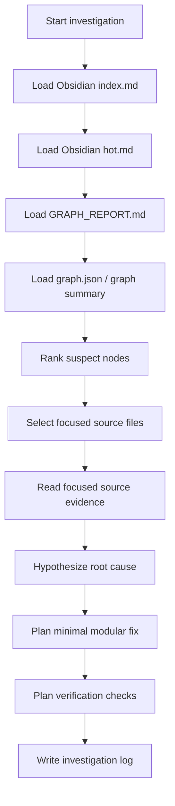

# Phase 3 Agent Workflow Diagram

Status: final agent workflow view.

## Context Rule

The workflow must read Obsidian and graph artifacts before raw source code.

## Selected Bug Target

The workflow is locked to `print_final_scores` global-state coupling unless a human changes the target.
