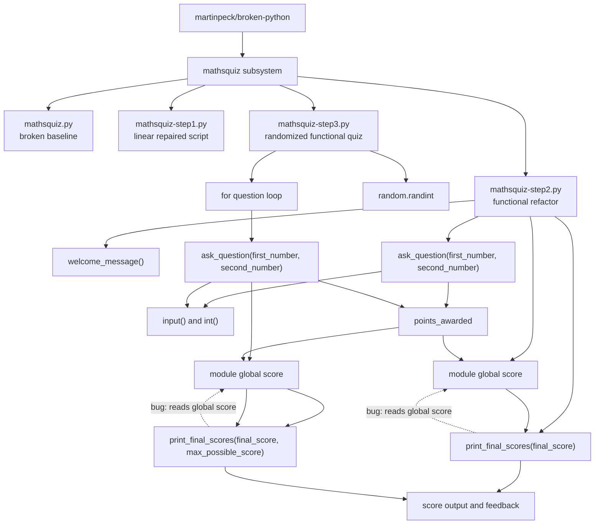

# Architecture Block Diagram

Status: Phase 2 draft.



## Interpretation

The architecture is procedural. `mathsquiz-step2.py` and `mathsquiz-step3.py` introduce functions, but the module-level script flow still owns execution order and score state.

The selected bug sits at the boundary between score accumulation and final reporting. `print_final_scores(...)` appears to receive the final score as an explicit argument, but internally it reaches back to the module-level `score` variable.

## Bug-Critical Path

```text
module-level quiz flow
-> ask_question(...)
-> points_awarded
-> global score accumulation
-> print_final_scores(final_score, ...)
-> hidden read of global score
```
