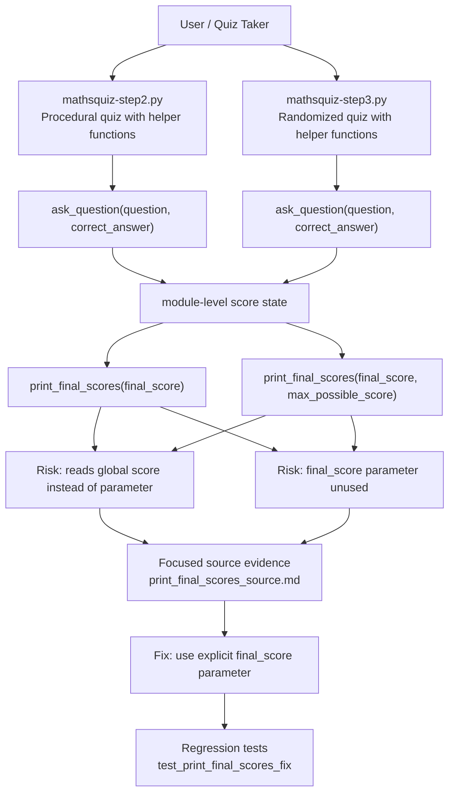

# Mathsquiz Architecture Graph

Status: generated during final Graphify local-run polish.

Source input:

- `artifacts/graphify/graph.json`
- `artifacts/graphify/GRAPH_REPORT.md`

Generation method:

- The course Graphify executable was not available locally.
- PyPI lookup for `graphify` returned no matching package.
- The graph below is generated from the existing Graphify-style graph artifacts produced earlier by Python AST/static analysis.

## Architecture Graph

## What This Shows

This graph shows the bug-critical architecture for the `mathsquiz` subsystem. Both `mathsquiz-step2.py` and `mathsquiz-step3.py` collect score state through quiz execution, then call `print_final_scores(...)`. The architectural defect is that the final-score functions expose parameterized interfaces but depend on hidden module-level `score`.

## Relation To The Fix

The fix changes the final-score boundary:

- Before: `print_final_scores(...) -> global score`
- After: `caller score -> final_score parameter -> print_final_scores(...)`

This reduces hidden coupling and makes the functions testable in isolation.

