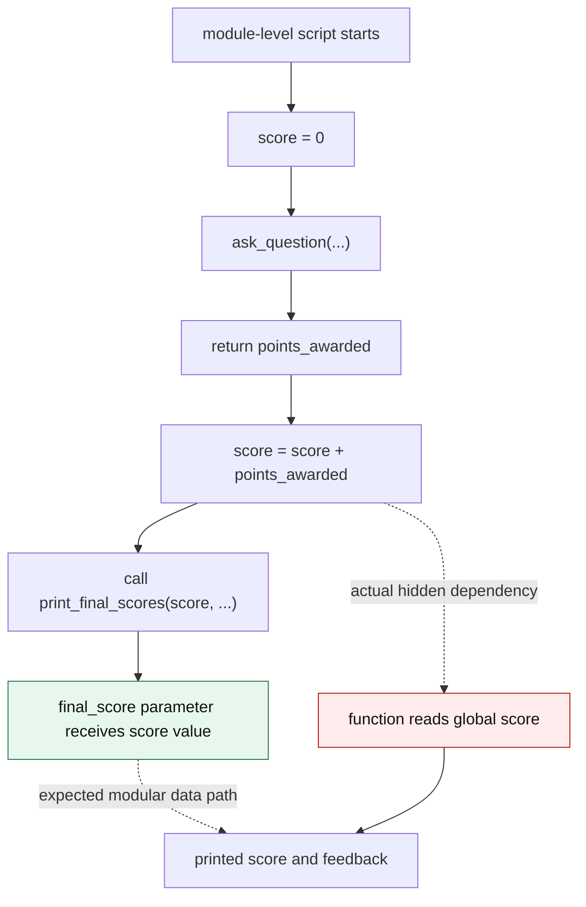

# Score State Flow Diagram

Status: Phase 2 completion view.

## Purpose

The existing architecture and module diagrams show structure. This diagram isolates the data/state flow that creates the selected `print_final_scores` bug.



## What This Shows

The intended design is simple: the caller calculates `score`, passes it as `final_score`, and `print_final_scores(...)` prints/evaluates that argument.

The actual design has a hidden side channel: `print_final_scores(...)` reads the module-level global `score`. That makes the function's output depend on ambient state instead of the explicit parameter contract.

## Relevance to the Bug

This is the most direct architectural view of the selected bug. It shows why the defect is a modularity issue rather than only a typo:

- The parameter path exists.
- The function ignores the parameter path.
- The hidden global-state path controls the final result.

## Phase 4 Fix Implication

The fix should remove the hidden dependency edge:

```text
print_final_scores(...) -> global score
```

and keep only the explicit input edge:

```text
caller score -> final_score parameter -> printed score and feedback
```
